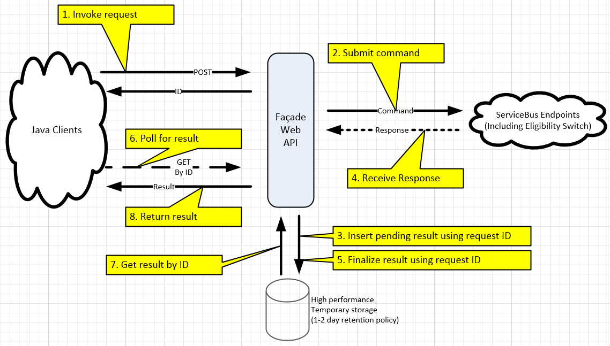

NServiceBus Facade
=================
A starter implementation for facade with NServiceBus-Backed ESB

[A discussion on StackOverflow](http://stackoverflow.com/questions/6696680/is-nservicebus-a-good-fit-for-cross-platform-integration) led to this example approach for integrating non-.NET services into an NServiceBus-Backed ESB via the use of a front-end facade.

In this design a REST service exposes available methods and status polling over HTTP and uses a NOSQL database to store and track pending operations.

* Web services built using ASP.NET WEB API v2
* NOSQL database can be performed in-memory or using an auto-configured RavenDB instance with adjustable document lifetime
* Unit tests and load tests are included in the sample to prove effectiveness under heavy demand (<2ms store/forward response times witnessed in practice)

It should be noted that this is one of many alternative approaches including building a direct bus client in multiple languages capable of reading and writing messages built by the NServiceBus framework.

